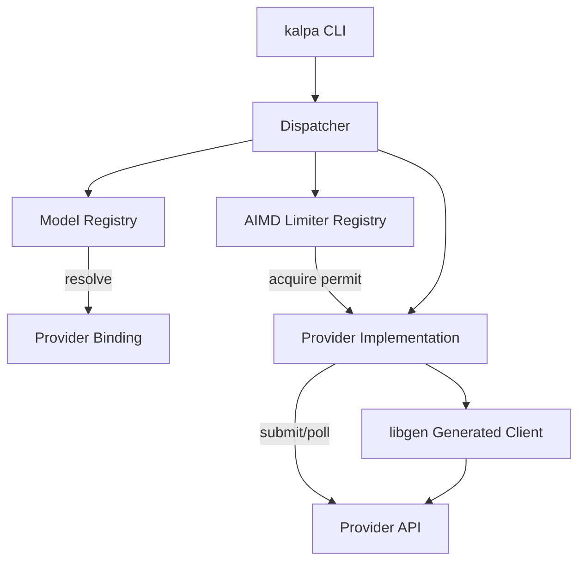

# kalpa

A unified CLI and Rust library for multimodal AI generation across providers.

---

## Overview

kalpa provides a single, consistent interface to generate text, images, and video using multiple AI providers from the terminal or as a Rust library. It abstracts the differences between provider APIs behind a common trait system, handles authentication, manages async job lifecycles, and applies adaptive concurrency control to respect provider rate limits.

The project is designed for developers and teams who work with several AI services simultaneously and want a unified tool rather than maintaining separate SDKs and scripts for each provider.

Design goals:

- Provider-neutral interface with type-safe traits
- Multimodal: text, image, video, audio, and embeddings through one request/response model
- Adaptive rate limiting (AIMD) that responds to real back-pressure rather than hardcoded limits
- Async-first architecture built on tokio
- Type-safe client code generated from OpenAPI specifications at compile time

---

## Features

- Text generation via OpenAI, Google Gemini, Google Vertex AI, and Anthropic Claude
- Image generation via Fal.ai, OpenAI (DALL-E), and Google Vertex AI (Imagen)
- Video generation via Fal.ai and Google Vertex AI (Veo)
- Text-to-speech and speech-to-text support (OpenAI TTS/Whisper)
- Interactive CLI with colored output and progress indicators
- Async job tracking for long-running generations (queue-based polling)
- AIMD concurrency limiter with per-binding and per-provider ceilings
- Model registry with logical-to-provider binding resolution
- Retry with exponential backoff for transient failures
- OpenAPI-generated type-safe SDK clients (via progenitor)
- Configuration stored in `~/.config/kalpa/config.toml`
- JSON output mode for scripting and automation
- Nix flake for reproducible builds and development environments

---

## Architecture

kalpa is structured as a Rust workspace with three crates:

```
kalpa/
├── crates/
│   ├── core/         Core library: traits, types, providers, rate limiting
│   ├── cli/          CLI binary application
│   └── libgen/       OpenAPI spec → Rust SDK code generation
├── docs/             Provider-specific documentation
├── Cargo.toml        Workspace definition
└── flake.nix         Nix build and dev shell
```

**kalpa-core** defines the provider trait hierarchy (`GenerationProvider`, `CompletionProvider`, `ImageGenerationProvider`, `VideoGenerationProvider`, `SpeechProvider`, `TranscriptionProvider`) and includes implementations for each backend. The `Dispatcher` routes generation requests through the model `Registry`, resolves logical model names to concrete provider bindings, gates concurrency through the `LimiterRegistry`, and drives the submit/poll lifecycle.

**kalpa-cli** provides the user-facing `kalpa` binary with subcommands for configuration, authentication, model listing, content generation, job management, and status checking.

**kalpa-libgen** reads OpenAPI 3.0 spec files from `specs/` and generates type-safe Rust client code at compile time using progenitor. Generated SDKs cover Fal.ai, OpenAI, Gemini, Vertex AI, and Claude.



The generation flow:

1. CLI parses the command and determines provider + model
2. `Registry` resolves the model reference (logical slug or pinned `provider:slug`) to a concrete binding
3. `LimiterRegistry` provides a two-level gate: parent (provider account ceiling) then per-binding (adaptive AIMD)
4. Provider `submit()` sends the request; synchronous providers return inline, queue-based providers return a `JobHandle`
5. For async providers, `poll()` loops until terminal state (completed or failed)
6. AIMD signals (429 rejection, completion at saturation, latency gradient) adjust concurrency limits

---

## Installation

### From source (Cargo)

```bash
git clone https://github.com/storyvis/kalpa.git
cd kalpa
cargo build --release
```

The binary is produced at `target/release/kalpa`.

### With Nix

```bash
nix build .#kalpa
```

Or run directly:

```bash
nix run .#kalpa
```

---

## Requirements

- Rust 2021 edition (stable toolchain)
- tokio async runtime (bundled as dependency)
- Network access to provider APIs
- API keys for the providers you intend to use

No GPU, CUDA, or special hardware is required. kalpa is a client that calls remote APIs.

Optional:

- Nix (for reproducible builds via `flake.nix`)
- direnv (the repository includes `.envrc` with `use flake`)

---

## Configuration

kalpa stores configuration at `~/.config/kalpa/config.toml`. The file is created automatically on first use via `kalpa configure`.

Example configuration:

```toml
[defaults]
provider = "gemini"
format = "text"

[providers.fal]
api_key = "..."
default_model = "fal-ai/flux/dev"

[providers.openai]
api_key = "sk-..."
default_model = "gpt-4.1-mini"

[providers.gemini]
api_key = "..."
default_model = "gemini-2.5-flash"

[providers.claude]
api_key = "..."
default_model = "claude-sonnet-4-6"

[providers.vertex]
service_account_path = "/path/to/service-account-key.json"
gcs_bucket = "gs://my-bucket"
location = "us-central1"
default_model = "gemini-2.5-flash"
```

### Environment Variables

| Variable | Required | Description | Default |
|----------|----------|-------------|---------|
| `RUST_LOG` | No | Controls tracing/logging verbosity (standard `tracing` filter syntax) | `warn` |

All provider credentials are managed through the config file, not environment variables.

---

## Running the Project

After building, configure at least one provider:

```bash
kalpa configure
```

This launches an interactive wizard. Alternatively, set keys directly:

```bash
kalpa configure --set gemini.api_key YOUR_KEY
kalpa configure --set openai.api_key sk-YOUR_KEY
kalpa configure --set claude.api_key YOUR_KEY
kalpa configure --set fal.api_key YOUR_KEY
```

Verify authentication:

```bash
kalpa auth --all
```

---

## Usage

### Text Generation

```bash
kalpa generate -g text "Explain quantum computing"
kalpa generate -o text "Write a haiku about code"
kalpa generate -c text "Summarize this concept"
kalpa generate -v text "Explain machine learning"

# Specify a model explicitly
kalpa generate -g --model gemini-2.5-flash text "Hello"
kalpa generate -c --model claude-sonnet-4-6 text "Write a poem"
```

### Image Generation

```bash
kalpa generate -f image "A cyberpunk city at night"
kalpa generate -o image "Abstract geometric art"
kalpa generate -v image "Beautiful sunset over mountains"

# Specific model
kalpa generate -f --model fal-ai/flux-pro image "Photorealistic portrait"
kalpa generate -o --model dall-e-3 image "Surreal landscape"
```

### Video Generation

```bash
kalpa generate -f video "Ocean waves crashing on shore"
kalpa generate -v video "A spinning globe"

# Async mode (returns immediately, poll with kalpa jobs)
kalpa generate -f --model fal-ai/minimax/video-01 video --async "Flying bird"

# Image-to-video
kalpa generate -f --model fal-ai/luma-dream-machine/image-to-video video -i ./input.jpg "Animate this scene"
```

### Job Management

Long-running generations (video) create tracked jobs:

```bash
kalpa jobs                       # List all jobs
kalpa jobs <job-id>              # Check specific job (live status check)
kalpa jobs --clear-completed     # Remove completed jobs
kalpa jobs --clear-failed        # Remove failed jobs
kalpa jobs --delete <job-id>     # Delete a specific job
```

### Other Commands

```bash
kalpa models                     # List all available models
kalpa models -f                  # List Fal.ai models only
kalpa status                     # Check configuration status of all providers
kalpa configure --show           # View current configuration (keys masked)
```

### Global Flags

```bash
kalpa --json <command>           # Output as JSON instead of formatted text
kalpa --verbose <command>        # Enable debug logging
```

### Library Usage

Add `kalpa-core` to your `Cargo.toml`:

```toml
[dependencies]
kalpa-core = { git = "https://github.com/storyvis/kalpa.git" }
tokio = { version = "1", features = ["full"] }
```

```rust
use kalpa_core::{
    providers::FalAIProvider,
    ImageGenerationProvider,
    ImageGenerationRequest,
};

#[tokio::main]
async fn main() -> Result<(), Box<dyn std::error::Error>> {
    let fal = FalAIProvider::new("your-api-key".to_string());

    let request = ImageGenerationRequest {
        prompt: "A cyberpunk cityscape at night".to_string(),
        model: "fal-ai/flux/dev".to_string(),
        size: Some("1024x1024".to_string()),
        n: Some(1),
    };

    let response = fal.generate_image(&request).await?;
    println!("Image URL: {:?}", response.images[0].url);
    Ok(())
}
```

---

## Development

### Prerequisites

With Nix (recommended):

```bash
nix develop
```

This provides the full Rust toolchain and all dependencies.

Without Nix, ensure you have a Rust stable toolchain installed.

### Building

```bash
cargo build              # Debug build
cargo build --release    # Release build
```

### Running Tests

```bash
cargo test
```

Tests are colocated with the source code (inline `#[cfg(test)]` modules). Key test coverage includes:

- `crates/core/src/dispatcher.rs` — request routing and AIMD gating
- `crates/core/src/ratelimit.rs` — multiplicative decrease, additive increase, cooldown debouncing, latency gradient
- `crates/core/src/registry.rs` — logical and pinned model resolution, modality filtering
- `crates/core/src/generation.rs` — multimodal part serialization, model ref parsing

### Code Structure

```bash
cargo doc --open         # Generate and view API documentation
```

### Adding a New Provider

1. Create the OpenAPI 3.0 spec at `crates/libgen/specs/<name>.json`
2. Add the module in `crates/libgen/src/lib.rs`
3. Implement the relevant provider traits in `crates/core/src/providers/<name>.rs`
4. Register the provider in `crates/core/src/providers/mod.rs`
5. Add CLI support in `crates/cli/src/commands/`

---

## Testing

Run the full test suite:

```bash
cargo test
```

Run tests for a specific crate:

```bash
cargo test -p kalpa-core
cargo test -p kalpa-cli
```

Run a specific test:

```bash
cargo test -p kalpa-core registry::tests::resolve_logical_and_pinned
```

All tests are unit tests that run without network access (providers are mocked where needed).

---

## Performance Notes

kalpa implements an AIMD (Additive Increase / Multiplicative Decrease) concurrency limiter that adapts to real provider back-pressure:

- **Multiplicative decrease** on HTTP 429/503 responses, debounced by a configurable cooldown to avoid reacting multiple times to a single overload burst
- **Additive increase** on successful completions when the limiter was saturated (all permits in use)
- **Latency-gradient decrease** when observed latency exceeds a threshold ratio over the running baseline (EWMA), catching queue saturation before errors surface

The limiter operates at two levels: a per-provider parent ceiling (shared account quota) and a per-binding limiter (individual model/region). Both permits are held for the entire unit of work.

Default AIMD parameters:

| Parameter | Default | Description |
|-----------|---------|-------------|
| `initial` | 4 | Starting concurrency limit |
| `min` | 1 | Floor (maintains liveness) |
| `max` | 64 | Ceiling (backstop) |
| `decrease_factor` | 0.5 | Multiplicative decrease ratio |
| `cooldown` | 500ms | Debounce window for decrease signals |
| `latency_threshold` | 2.0x | Latency gradient trip ratio |

Retry with exponential backoff is also available for transient failures (network errors, 5xx, 429), with configurable max attempts, initial backoff, and multiplier.

---

## Contributing

1. Fork the repository
2. Create a feature branch (`git checkout -b feature/your-feature`)
3. Make your changes
4. Run `cargo test` to verify all tests pass
5. Run `cargo fmt` to ensure consistent formatting
6. Run `cargo clippy` to check for common issues
7. Commit your changes with a clear message
8. Open a pull request against `main`

---

## Citation

If this project contributes to your research, publication, product, thesis, or any other work, please cite the project by referencing this repository and acknowledge the author.

For citation requests or questions, contact:

**Shaswot Paudel**

**Email:** [shaswotpaudelwork@gmail.com](mailto:shaswotpaudelwork@gmail.com)

---

## License

Apache License 2.0. See [LICENSE](LICENSE) for the full text.
